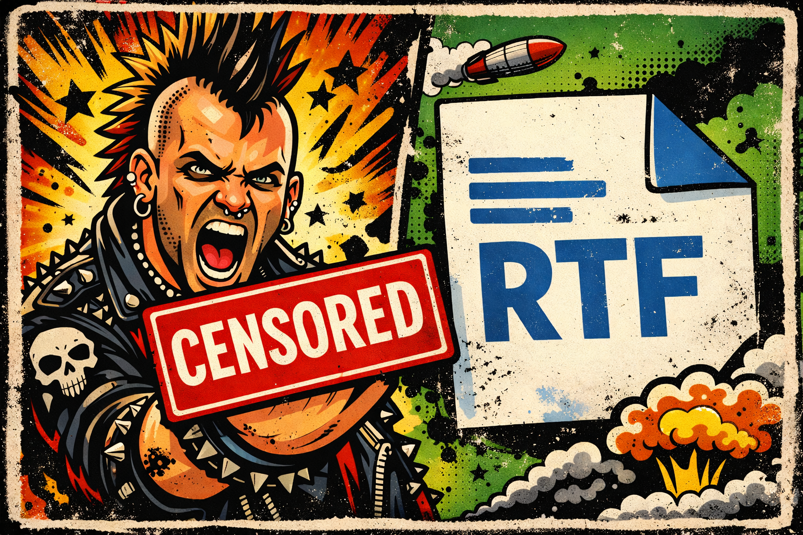

# RTF Eff-U Extract: A parser for the file format we all love to hate



A Python tool to extract URLs from RTF and DOC embedded objects using oletools/rtfobj with support for obfuscation detection, CLSID mapping, and optional shellcode emulation. Yep we used the vibes, and there is like 1000% rough edges

## Features

- **RTF Validation**: Checks for `{\rt` header to validate RTF files
- **Structure-Based Parsing**: Parses known OLE object structures (Package, OLE2Link, Equation Editor)
- **URL Extraction**: Supports both ASCII and wide/UTF-16 encoded URLs
- **Deobfuscation**: Removes common obfuscations:
  - Whitespace injection (spaces, tabs, newlines)
  - RTF comments and control words
  - Null byte padding
  - Hex encoding tricks
- **CLSID Mapping**: Associates ActiveX controls with extracted URLs
- **Known Exploit Detection**: Identifies dangerous controls (Equation Editor 3.0, etc.)
- **Shellcode Emulation** (optional): Uses Speakeasy emulator to extract URLs from obfuscated shellcode

## Installation

### From source (recommended):
```bash
pip install -e . --break-system-packages
```

### Install dependencies only:
```bash
pip install -r requirements.txt
```

### Optional: Enable shellcode emulation
```bash
pip install speakeasy-emulator
```

## Usage

### Basic usage:
```bash
rtf-eff-u-extract malicious.rtf
```

### Verbose output with offsets:
```bash
rtf-eff-u-extract -v suspicious.rtf
```

### Export to JSON:
```bash
rtf-eff-u-extract --json results.json document.rtf
```

### With shellcode emulation (requires speakeasy-emulator):
```bash
rtf-eff-u-extract --emulate malicious.doc
rtf-eff-u-extract --emulate --timeout 30 suspicious.rtf
```

## How It Works

1. **RTF Validation**: Checks file starts with `{\rt`
2. **Object Extraction**: Uses rtfobj to parse and extract embedded OLE objects
3. **Deobfuscation**: Cleans hex-encoded data by removing:
   - RTF control words and comments
   - Whitespace injection
   - Junk tags in hex bodies
4. **URL Extraction**: Searches for URLs in multiple formats:
   - Standard ASCII URLs (`http://`, `https://`, `ftp://`)
   - Wide/UTF-16LE encoded URLs
   - Null-byte separated URLs
5. **CLSID Identification**: Maps object CLSIDs to known ActiveX controls (including dangerous controls like Equation Editor 3.0, Package objects, and Shell.Explorer.1)

## Output Format

```
================================================================================
RTF URL Extraction Results
================================================================================

Object #0:
  Class Name: Package
  CLSID: F20DA720-C02F-11CE-927B-0800095AE340
  Description: Package/Packager Object
  Raw Data Size: 4096 bytes
  URLs Found: 2
    [ascii] hxxp://malicious-domain[.]com/payload.exe
    [wide] hxxps://evil[.]example[.]com/dropper.dll

================================================================================
Total Objects: 1
Total URLs: 2
================================================================================
```

## Examples

### Example 1: Shell.Explorer.1 with embedded URL (structure-based extraction)
```bash
$ rtf-eff-u-extract Registration_Form.rtf
```

```
Analyzing RTF file: Registration_Form.rtf

================================================================================
RTF URL Extraction Results
================================================================================

Object #0:
  Class Name: Shell.Explorer.1
  CLSID: EAB22AC3-30C1-11CF-A7EB-0000C05BAE0B
  Description: Shell.Explorer.1 (Internet Explorer Shell Link)
  Raw Data Size: 3072 bytes
  URLs Found: 1
    [ShellExplorer-structure] hxxps://gcloud-us-east-02[.]vr2uk2d5x[.]workers[.]dev/Registration_Form.pdf

================================================================================
Total Objects: 1
Total URLs: 1
================================================================================
```

### Example 2: Equation Editor shellcode (emulation required)
```bash
$ rtf-eff-u-extract --emulate w.doc
```

```
Analyzing RTF file: w.doc
Shellcode emulation: ENABLED (timeout: 10s)

================================================================================
RTF URL Extraction Results
================================================================================

Object #0:
  Class Name: None
  Raw Data Size: 1749 bytes
  URLs Found: 1
    [raw-emulation-report_arg] hxxp://66[.]179[.]94[.]117/157/fsf090g90dfg090asdfxcv0sdf09sdf90200002f0sf0df09f0s9f0sdf0sf00ds.vbe

================================================================================
Total Objects: 1
Total URLs: 1
================================================================================
[*] Saved full Speakeasy report to speakeasy_obj_0_raw.json
```

### Example 3: CVE-2017-11882 (Equation Editor exploit)
```bash
$ rtf-eff-u-extract samples/cve-2017-11882.rtf
```

```
Analyzing RTF file: samples/cve-2017-11882.rtf

================================================================================
RTF URL Extraction Results
================================================================================

Object #0:
  Class Name: Equation.3
  CLSID: 0002CE02-0000-0000-C000-000000000046
  Description: Microsoft Equation Editor 3.0 (CVE-2017-11882)
  Raw Data Size: 2048 bytes
  URLs Found: 1
    [ascii] hxxp://attacker[.]com/shellcode.bin
```

## Technical Details

### Deobfuscation Techniques

Based on research from [Google Cloud's RTF Malware Evasion Analysis](https://cloud.google.com/blog/topics/threat-intelligence/how-rtf-malware-evades-detection), the tool handles these sophisticated obfuscation patterns:

1. **Whitespace Injection**:
   ```
   68 74 74 70 3a 2f 2f    →    687474703a2f2f
   (spaces, tabs, \r and \n removed)
   ```

2. **Escaped Special Characters**:
   ```
   68\{74\}74\+70\-3a\%    →    687474703a
   (escaped \\, \{, \}, \+, \-, \% removed)
   ```

3. **Unicode Control Words**:
   ```
   68\uc16 \u8364 74        →    6874
   (\ucN and \uN are ignored)
   ```

4. **RTF Comments & Ignorable Destinations**:
   ```
   68{\*\comment junk}74    →    6874
   {\*\generator Word}      →    (ignored)
   ```

5. **\\' Escape Sequence Disorder**:
   ```
   01\'1122    →    The \'11 resets hex state, dropping the high nibble
   341\'112345  →    342345
   ```
   This technique exploits the RTF parser's state machine to cause bytes to be dropped.

6. **Split Control Words**:
   ```
   {\sn pFr}{\sn agments}    →    pFragments
   ```
   Control words can be split across multiple groups to evade signature detection.

7. **Oversized Control Words**:
   ```
   \bin[254 chars]objdata    →    Parser truncates at 0xFF, data follows
   ```
   Exploits MS Word's 0xFF buffer limit for control words.

8. **Oversized Numeric Parameters**:
   ```
   \bin41541544011...003    →    Custom atoi overflow, true value=3
   ```
   MS Word's custom integer parser handles overflow differently than standard atoi.

9. **Multiple \objdata Entries**:
   ```
   \objdata decoy1 \objdata decoy2 \objdata actual
   ```
   RTF parser uses the **last** \objdata, allowing decoys to hide the real payload.

10. **Control Words in Hex Context**:
    ```
    68\par74    →    6874 (control word ignored)
    ```

11. **Null Byte Padding**:
    ```
    h\x00t\x00t\x00p\x00     →    http
    ```

### URL Detection

- **ASCII URLs**: Standard regex pattern matching
- **Wide URLs**: Detects UTF-16LE encoded URLs (common in OLE objects)
- **Cleaned URLs**: Removes null bytes and extracts mangled URLs

## License

MIT License
